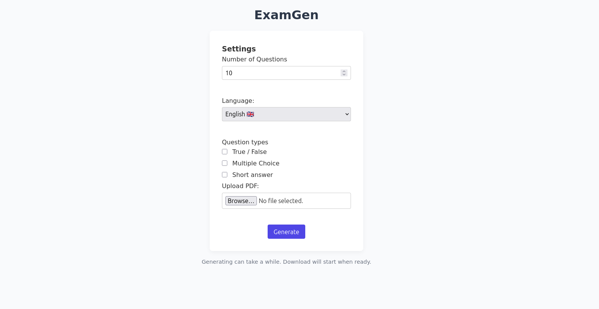

# ExamGen

Generates exam training questions from provided PDF documents containing notes, summaries, and other educational materials.

- Generate as many questions as you want
- Customize question types (multiple choice, true/false, short answer)
- Language support (Korean, English, etc.)
    - You can add as many as you want by editing `index.html`
- Choose your style: Light, Dark, Modern (Violet)




## Settings
- SHOW_QUESTIONS: If set to `True`, the generated questions will be printed to the console.
- FONTPATH: (optional) Override font for special characters. Leave to `""` if not needed.

## Setup
Provide a `.env` file in the root directory with the following variables:
```
URL=https://subdomain.domain.whatever
KEY=apikey
LLM=ollama_chat/yourmodel:8b
```
> [!TIP]
> I recommend using larger models, `gemma3:27b` worked well.

If you do not use a hosted model, refer to [this guide](https://dspy.ai/).

This uses Poetry: 
1. Install dependencies: `poetry install`
2. Run module: `poetry run examgen`

## Dependencies
- "dspy (>=3.0.1,<4.0.0)",
- "pypdf (>=6.0.0,<7.0.0)",
- "reportlab (>=4.4.3,<5.0.0)",
- "python-dotenv (>=1.1.1,<2.0.0)",
- "flask (>=3.1.1,<4.0.0)"

> [!IMPORTANT]
> You may be missing fonts depending on your language.
> For Korean, that is `fonts-nanum`. (`sudo apt install fonts-nanum`)
> If this is not installed, Characters may render incorrectly.